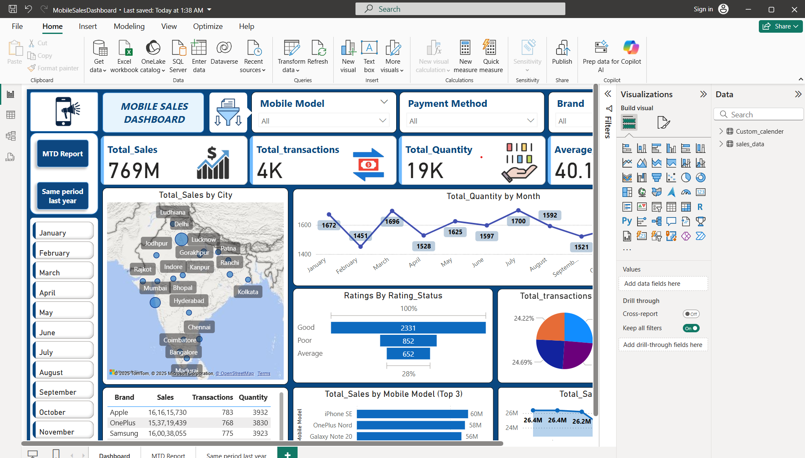

# 📱 Mobile Sales Dashboard - Power BI Project
This project presents a **Mobile Sales Dashboard** built using Power BI. It enables deep analysis of mobile sales data across brands, models, cities, payment methods, customer ratings, and time periods. The dashboard helps monitor key business metrics and trends in a visually rich, interactive format.

---
## 📦 File Included
- `MobileSalesDashboard.pbix` — Main Power BI dashboard file.
---
## Main page view
- 
- rest other informative screenshots can be viewed in the screenshots folder.

## 📈 Dashboard Pages
### 1. 📌 **Dashboard (Main Overview)**
- KPIs with summary cards
- Total Sales by City (Map Visual)
- Quantity trend over months
- Transactions by Payment Method (Pie Chart)
- Sales by Brand and Mobile Model
- Customer Ratings Visual (Bar)
- Sales by Day (Line Chart)

### 2. 📅 **MTD Report**
- Month-To-Date sales line chart
- Filters: Model, Brand, Payment Method
- Year-Month-Day timeline trend

### 3. 📉 **Same Period Last Year**
- Side-by-side comparison with last year by:
  - Month
  - Quarter
  - Year
- Tabular summary and bar charts

---
- 
## 📊 Key Features
- ✅ **Dynamic Filters** for Brand, Model, Payment Method, and Time Period.
- 📍 **Geo Map View** of Total Sales by City.
- 📈 **MTD (Month-To-Date)** and **Year-on-Year (YoY)** comparisons.
- 📊 Bar, Line, Pie, and Card Visuals for full visibility.
- 🧠 Designed with KPIs, data storytelling, and interactivity in mind.

---

## 🧩 Technologies Used
| Tool        | Description                        |
|-------------|------------------------------------|
| Power BI    | Data visualization and reporting   |
| Power Query | Data transformation and shaping    |
| DAX         | Measures and time intelligence     |
| Excel/CSV   | Source data                        |

---

## 📌 KPI Summary
| KPI                  | Description                                      |
|----------------------|--------------------------------------------------|
| `Total_Sales`        | Sum of all mobile sales revenue (769M)          |
| `Total_Transactions` | Total number of individual sales (3835)         |
| `Total_Quantity`     | Total units sold (19K+)                         |
| `Average_Price`      | Avg. unit selling price (~₹40K)                |
| `MTD`                | Month-To-Date sales trend                      |
| `Same Period LY`     | Comparison with last year's performance         |

---

## 🧠 DAX Measures Used

```dax
Total_Quantity = SUM(sales_data[Units Sold])
Total_Sales = SUMX(sales_data, sales_data[Units Sold] * sales_data[Price Per Unit])
Total_transactions = COUNTROWS(sales_data)
Average_Price = AVERAGE(sales_data[Price Per Unit])
MTD = TOTALMTD([Total_Sales], Custom_calender[Date])
Same Period Last Year = CALCULATE([Total_Sales], SAMEPERIODLASTYEAR(Custom_calender[Date]))
```
## 🔄 Data Model Overview
Two main tables:
  1. sales_data: transactional data
  2. Custom_calender: date table
- One-to-many relationship on Date column

## 💡 Insights Derived
 - 📍 Top Cities: Mumbai, Delhi, Bangalore lead in sales
 - 📦 Popular Brands: Apple, OnePlus, Samsung
 - 💳 Payment Preference: Debit Card & UPI dominate
 - 🔁 Monthly Sales Fluctuations observed (lowest in May, highest in July)
 - ⭐ Customer Ratings are mostly "Good"

## 📂 How to Run
 - Download and open MobileSalesDashboard.pbix in Power BI Desktop.
 - Use slicers to filter by brand, model, payment method, or year.
 - Hover or click visuals to explore data.
 - Use "Refresh" if connected to a live source.
